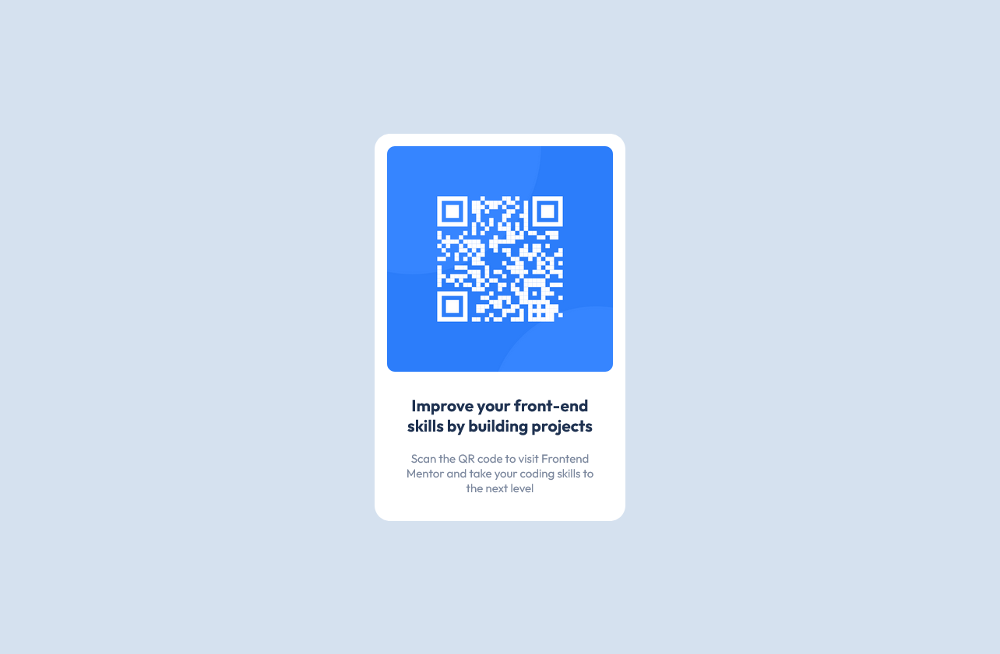

# Frontend Mentor - QR code component solution

This is a solution to the [QR code component challenge on Frontend Mentor](https://www.frontendmentor.io/challenges/qr-code-component-iux_sIO_H). Frontend Mentor challenges help you improve your coding skills by building realistic projects.

## Table of contents

- [Overview](#overview)
  - [Screenshot](#screenshot)
  - [Links](#links)
- [My process](#my-process)
  - [Built with](#built-with)
  - [What I learned](#what-i-learned)
  - [Continued development](#continued-development)
- [Author](#author)

## Overview

### Screenshot



### Links

- Solution URL: [https://github.com/Kinzume/qr-code-component-main](https://github.com/Kinzume/qr-code-component-main)
- Live Site URL: [kinzume.github.io/qr-code-component-main/](kinzume.github.io/qr-code-component-main/)

## My process

### Built with

- HTML5 markup
- CSS Flexbox
- Flexbox

### What I learned

This was a great project to practice my CSS skills. I enjoyed playing around with the position and flexbox grid row-gap properties on the spacing to make the content match as close as possible to the original design.

```html
<section id="qr-code-card">
  <div id="content">
    
    <div id="text">
      <h1>Improve your front-end skills by building projects</h1>
      <p>
        Scan the QR code to visit Frontend Mentor and take your coding skills to
        the next level
      </p>
    </div>
  </div>
</section>
```

```css
#qr-code-card #content {
  display: flex;
  flex-direction: column;
  row-gap: 2rem;
  position: relative;
  top: 1.13rem;
}
```

### Continued development

This challenge gave me an opportunity to practice my CSS flexbox and positioning skills. I'll continue using these skills in future projects.

One thing I'll start focusing on is designing the mobile version first before the desktop version when styling my HTML (although for this case I found that the mobile version appeared just as good as the desktop version).

## Author

- Frontend Mentor - [@Kinzume](https://www.frontendmentor.io/profile/Kinzume)
